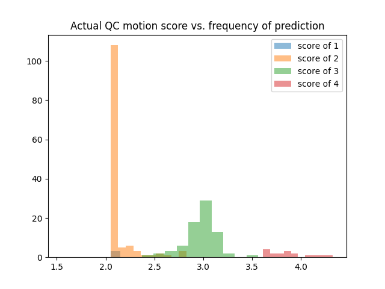

BCP Motion QC Score
===================

Model 3
-------

* Standardized RMSE (on validation set): **0.3486471956656407**
* Mean squared error (on validation set): 0.1235
* Model architecture: AlexNet3D_Dropout_Regression
* Optimizer: Adam
* Epochs: 1000
* Location: */home/feczk001/shared/data/AlexNet/model03.pt*

Model 4
-------

* Standardized RMSE (on validation set): **0.5025856541174554**
* Mean squared error (on validation set): 0.1426
* Model architecture: Luna
* Optimizer: Adam
* Epochs: 1000
* Location: */home/feczk001/shared/data/AlexNet/model04.pt*

Model 2
-------

* Mean squared error (on validation set): **0.4121**
* Model architecture: AlexNet3D_Dropout_Regression
* Optimizer: Adam
* Epochs: 100

Model 1
-------

* Mean squared error (on validation set): **0.4855**
* Model architecture: AlexNet3D_Dropout_Regression
* Optimizer: Adam
* Epochs: 55

Model 5
-------

* Standardized RMSE (on validation set): **[undefined---sigma was zero**
* Mean squared error (on validation set): 0.3301
* Model architecture: AlexNet3D_Dropout_Regression
* Optimizer: SGD
* Epochs: 1000
* Location: */home/feczk001/shared/data/AlexNet/model05.pt*
